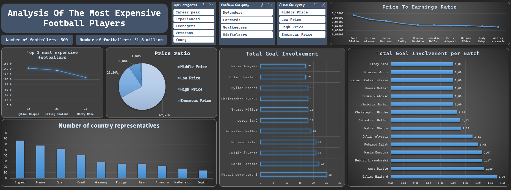

# Excel Football Player Analysis

Excel dashboard for analyzing football player market value and performance.

## Tools
- Microsoft Excel
- Pivot Tables
- Pivot Charts
- Slicers
- Calculated Columns

## Dataset
The dataset contains information about 500 football players including:
- Market value
- Goals and assists
- Matches played
- Age and position
- Country and club

## Dashboard Features
- Interactive filters (Age category, Position, Price category)
- KPI metrics (Average market value, Total players)
- Top most expensive players analysis
- Goal involvement and efficiency analysis

## Files
- `Football-Players.xlsx` – Excel dashboard
- `players.csv` – dataset

## Dashboard Preview

